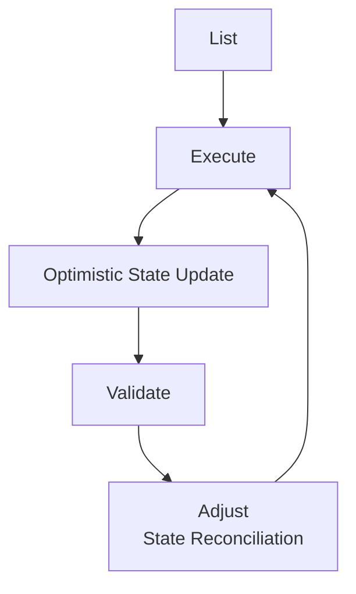
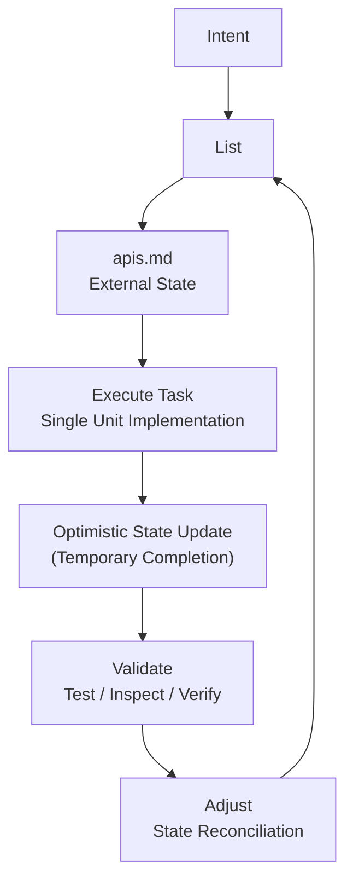

# LEVA Execution Workflow

A lightweight execution workflow for structured LLM-assisted development using external state.

LEVA is not a tool, framework, or system.
It is a **tool-agnostic execution workflow that structures how humans interact with LLMs under context constraints**.

## Problem Statement

When working with LLMs in real development workflows, especially in token-constrained environments, several issues frequently appear:

- **Over-prompting**: too much instruction in a single request
- **Context flooding**: irrelevant or excessive context reduces model focus
- **Blind execution**: output is trusted without verification

These issues lead to:
- inefficient token usage
- inconsistent or untraceable outputs
- difficulty managing multi-step development tasks

## Core Idea

LEVA introduces a structured execution loop:

> **List → Execute → Validate → Adjust**

Instead of treating LLM interaction as single-shot prompting, LEVA treats it as a **stateful, iterative workflow supported by external artifacts (e.g. Markdown files)**.

## Key Principle

> LEVA does not improve the model. It structures human–LLM interaction through externalized state and iterative execution.

## Workflow Overview

LEVA is not strictly linear. It is a **state-driven loop**.




## Core Stages

### 1. List

Break down the problem into structured tasks.

- Analyze requirements or codebase
- Decompose into actionable units
- Store in external artifact (e.g. apis.md)

Example:

```
From the existing models in the codebase, create a route structure in apis.md.
```

### 2. Execute

Execute tasks one at a time.

- Focus on a single task only
- Keep context minimal
- Produce scoped output

Important:

After execution, task state may be updated optimistically (e.g. marked as completed), even before validation.

Example:

```
Just create User Management routes from apis.md
```

### 3. Validate

Verify execution results outside the LLM.

Validation methods include:

- automated tests (e.g. `php artisan test)`
- runtime checks
- manual review

This step ensures correctness is grounded in system reality, not model output.

### 4. Adjust

Reconcile system state based on validation results.

- Confirm or revert optimistic updates
- Fix incorrect task status
- Re-open failed tasks if necessary
- Refine remaining task structure

Example:

```
Continue create Schedule Management routes from apis.md
```

## State Model

LEVA uses a hybrid state model:

### Optimistic State (Post-Execute)

- tasks may be marked as completed
- fast iteration
- temporary assumption of correctness

### Confirmed State (Post-Validate)
- validation confirms or rejects execution
- state is corrected if needed
- final truth is synchronized

> This model enables fast progress without losing correctness guarantees.

## Workflow Diagram



## Example Use Case (Laravel)

1. Generate task breakdown:

- models.md
- apis.md
- tests.md

2. Execute sequentially:

- implement model layer
- then API layer
- then tests

3. Validate:

- run `php artisan test`
- manual API verification

4. Adjust:

- correct task status
- re-plan failed tasks
- sync progress in Markdown artifacts

## When to Use LEVA

- ✔ Multi-step development tasks
- ✔ Codebase refactoring
- ✔ AI-assisted debugging
- ✔ Token-constrained environments
- ✔ Iterative feature development

## When NOT to Use LEVA

- ✘ Simple one-shot prompts
- ✘ Quick rewriting tasks
- ✘ Brainstorming or ideation
- ✘ Fully automated CI/CD pipelines


## Comparison

### One-shot prompting (CREATE-style)

- single-pass execution
- high context usage
- low controllability

### Spec-driven systems (OpenSpec)

- formal system design
- strong structure enforcement
- heavier tooling layer


### LEVA Execution Workflow

- lightweight execution layer
- externalized state via artifacts
- focuses on interaction control, not system design

## Limitations

LEVA requires:

- discipline in maintaining external artifacts
- correct task granularity
- consistent validation practices

It is not suitable for:

- fully automated systems
- zero-overhead interactions
- highly exploratory prompting

## Philosophy

LEVA is based on a simple principle:

> The quality of LLM-assisted development is determined not only by the model, but by the structure of interaction and state management.

## License

MIT