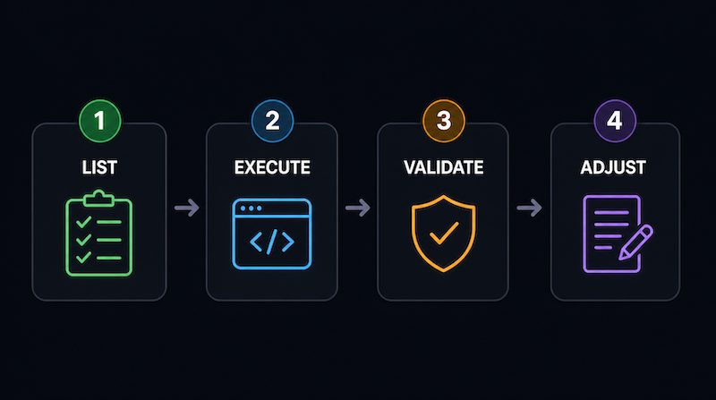
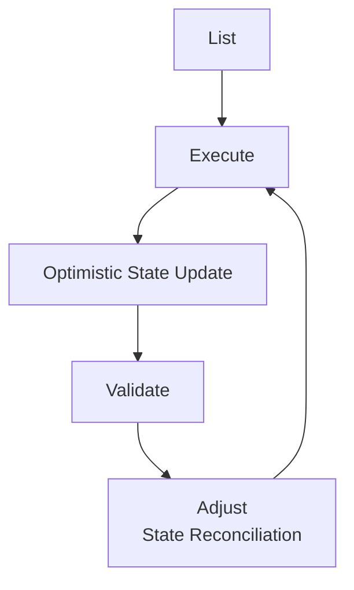
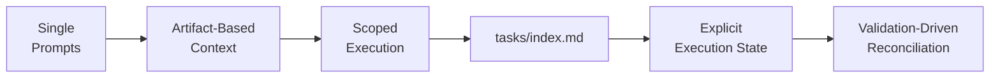

# LEVA Execution Workflow



A lightweight execution workflow for structured human-LLM collaboration using external state.

LEVA is not a framework, an autonomous agent system, or a specification standard. It is a lightweight, tool-agnostic workflow that helps structure iterative collaboration between humans and LLMs within an execution context and constraints.

Rather than attempting to replace developer workflows with rigid automation, LEVA focuses on creating a simple, easy-to-learn execution structure that supports a variety of working styles with AI tools.

# Why LEVA Exists

As LLMs become increasingly integrated into software development workflows, many developers encounter recurring problems with long-running AI-assisted tasks:

- too many prompts
- context overload
- hidden conversation states
- inconsistent execution continuity
- blind trust in the resulting output

In practice, adding more context often reduces execution quality rather than improving it.

These problems typically result in:

- noisy or unfocused output
- difficulty resuming between sessions
- inconsistent multi-step execution
- reduced traceability
- inefficient token usage

LEVA emerged from iterative experiments in real-world development workflows as an attempt to structure these interactions more explicitly.

## Core Idea

LEVA approaches AI-assisted development as a state management problem, not just a prompting problem.

Instead of relying on large prompts or rigid specification systems, LEVA externalizes execution state into lightweight artifacts like Markdown files.

The workflow is built around a simple iterative loop:

> **List → Execute → Validate → Adjust**

This creates a lightweight execution cycle where state becomes:

- inspectable
- progressable
- human-readable
- model-readable
- independent of a single conversation session

## Key Principle

> LEVA does not improve the model. It structures how humans manage execution, context, and validation while collaborating with LLMs.

## Workflow Overview

LEVA is not strictly linear.

It works more like a state-based execution loop:




## Core Stages

### 1. List

Break problems into smaller, explicit execution units.

Examples:

- API routes
- models
- validation rules
- tests
- refactoring tasks

Tasks are stored in lightweight external artifacts such as:

- `tasks/index.md`
- `apis.md`
- `tests.md`

The goal is not rigid planning, but scoped execution clarity.

Example:

```
Create route structure from existing models and store it in apis.md
```

### 2. Execute

Execute one scoped task at a time.

Principles:

- minimize active context
- avoid unrelated tasks
- keep execution bounded
- reduce context noise

Example:

```
Implement only User Management routes from apis.md
```

LEVA intentionally favors smaller iterative execution over large multi-feature prompts.

### 3. Validate

Execution results must be validated outside the model.

Validation may include:

- automated tests
- runtime verification
- static analysis
- manual inspection

Examples:

- `pytest`
- `php artisan test`
- API verification
- CLI execution checks

This step grounds correctness in system reality rather than conversational confidence.

### 4. Adjust

Update workflow state based on validation results.

Possible actions:

- confirm completed tasks
- reopen failed tasks
- refine remaining task structures
- correct optimistic execution assumptions

Example:

```
Continue Schedule Management routes after fixing validation failures
```
This creates iterative state reconciliation between:

- intended execution
- generated output
- actual system behavior

## State Model

LEVA uses a lightweight hybrid state model.

### Optimistic State

Immediately after execution:

- tasks may temporarily be marked as completed
- execution continues quickly
- correctness is assumed provisionally

### Confirmed State

After validation:

- task status is verified
- failed execution is corrected
- state is synchronized with reality

This enables fast iteration without fully sacrificing correctness.

## Workflow Evolution

LEVA did not begin as a complete system design.

The workflow evolved iteratively through repeated experimentation:



Many workflow rules emerged from practical failures during real AI-assisted development sessions.

For example:

```
Do not read files in tasks/done/
```

This rule emerged after observing that tasks completed in the past could pollute the active execution context and reduce focus on output.

## Example Use Case

A typical iterative workflow may include:

### Task Breakdown

- `models.md`
- `apis.md`
- `tests.md`
- `tasks/index.md`

### Sequential Execution

- implement model layer
- implement API layer
- generate tests
- refactor incrementally

### Validation

- run automated tests
- inspect runtime behavior
- verify API outputs


## Reconciliation

- update task status
- reopen failed tasks
- adjust remaining execution plan

## When LEVA Works Well

LEVA is particularly useful for:

- multi-step development tasks
- iterative feature development
- AI-assisted debugging
- refactoring workflows
- token-constrained environments
- long-running development sessions

## When LEVA Is Less Suitable

LEVA is not designed for:

- one-shot prompting
- fully autonomous systems
- highly exploratory brainstorming
- zero-overhead interactions
- rigid specification enforcement

## Relationship to Spec-Driven Development

LEVA does not reject structured planning.

However, it intentionally avoids highly rigid specification-driven workflows.

Developers work differently:

- iteratively
- conversationally
- incrementally
- experimentally

LEVA aims to provide lightweight execution structure without forcing a single style of thinking or development.

The goal is not to replace human workflows, but to support them.

## Philosophy

LEVA is based on a simple observation:

> The quality of AI-assisted development depends not only on model capability, but also on how humans structure execution, context, and state management.

## License

MIT